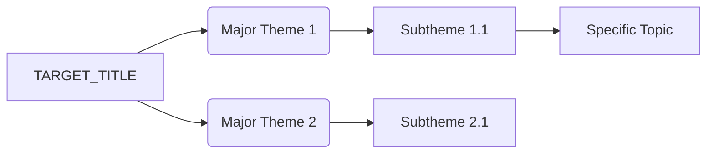

# BibTeX Theme Analyzer — Stage 1

Map a research landscape: read a BibTeX file, surface the recurring themes, draw them as a Mermaid tree, and propose a working title (`TARGET_TITLE`).

## Role in the pipeline

First stage of the `academic-pipeline`. Its output feeds Stage 2 (`academic-perspective-builder`). Behaves the same whether invoked standalone or by `academic-pipeline-orchestrator`.

## Inputs

- **A BibTeX file** — a path the user provides, an uploaded `.bib`, or pasted text. Read it directly with the Read tool or `mcp__workspace__bash`. There is no document-retrieval pagination step — the modern pipeline reads files directly.
- **Optional run folder** — supplied by the orchestrator. If absent, see *Output paths*.

## Output paths

All academic-pipeline artifacts for one run live in a single **run folder**:

- Intermediate JSON (this skill writes `theme_analysis.json`) → `<run folder>/pipeline/`
- Reader-facing deliverables (this skill writes `mermaid_diagram.md`) → `<run folder>/`

The orchestrator sets the run folder. When this skill runs standalone:

- In a MoxyWolf project session, use `<active project>/11 – Project Knowledge/Papers/<target-slug>/` and create it.
- Otherwise, ask the user where to save, or fall back to the Cowork outputs folder.

`<target-slug>` is the kebab-cased `TARGET_TITLE`.

## Process

### Step 1 — Read the bibliography

Load every entry. Capture entry key, type (`@article`, `@inproceedings`, `@book`, `@misc`, …), title, year, and `abstract`.

If fewer than 3 entries carry usable abstracts, stop and report — theme analysis needs abstract text to be meaningful:

```json
{ "status": "error", "error_type": "insufficient_data",
  "message": "Fewer than 3 BibTeX entries have usable abstracts. Run the bibtex-abstract-generator skill (Stage 0) first to enrich the file." }
```

This is the natural hand-back to **Stage 0 (`bibtex-abstract-generator`)** — suggest it explicitly.

### Step 2 — Analyze abstracts

Read across all abstracts and note: recurring methodologies, problem domains, named frameworks or systems, and any time clustering (e.g. most entries 2023–2025).

### Step 3 — Suggest TARGET_TITLE

Propose 2–3 descriptive titles that capture the dominant themes, include a timeframe when entries cluster, and reflect scope (narrow subdomain vs. broad survey). Give a one-line rationale for the lead suggestion.

Then **ask the user to confirm or replace the title** using the AskUserQuestion tool — offer the lead title, the alternatives, and let them write their own. The confirmed value becomes `TARGET_TITLE`.

### Step 4 — Extract and group themes

Build a hierarchical inventory: 3–7 top-level themes, related sub-themes under each, specific topics under sub-themes, and any cross-cutting threads. Organize thematically, not chronologically.

### Step 5 — Generate the Mermaid diagram



Use clear descriptive labels, valid Mermaid syntax, and logical parent-child relationships. Keep the diagram about themes, never about individual papers.

## Outputs

**`<run folder>/pipeline/theme_analysis.json`**

```json
{
  "target_title": "Multi-Agent AI Systems and Collaborative Intelligence (2023-2025)",
  "total_entries": 18,
  "entries_analyzed": 18,
  "major_themes": ["Agent Communication Standards", "Multi-Agent Consensus", "Reliability and Verification"],
  "bibtex_source_path": "<absolute path to the .bib used>",
  "created_at": "<ISO 8601 timestamp>"
}
```

**`<run folder>/mermaid_diagram.md`**

```markdown
# Thematic Analysis: <TARGET_TITLE>

## Synthesized Themes Tree

​```mermaid
<complete diagram>
​```

## Theme Synthesis

<detailed prose analysis of the themes and how the literature relates>
```

## Return to the orchestrator

```json
{
  "status": "complete",
  "target_title": "<TARGET_TITLE>",
  "mermaid_markdown": "<complete mermaid code>",
  "theme_synthesis": "<analysis text>",
  "bibtex_source_path": "<absolute path>",
  "output_files": ["<run folder>/pipeline/theme_analysis.json", "<run folder>/mermaid_diagram.md"]
}
```

## Notes

- Minimum 3 entries with abstracts for meaningful analysis; below that, route to Stage 0.
- If the user rejects every suggested title, take theirs and proceed.
- Keep the diagram focused on themes, not a paper-by-paper listing.
