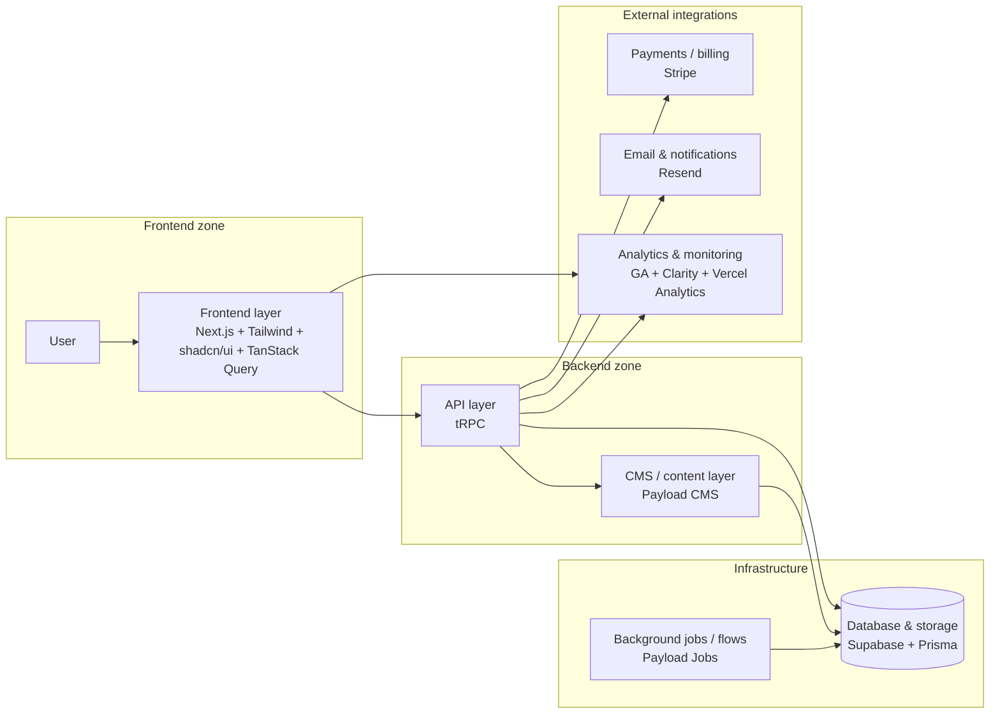

# Tech Stack Overview

*Aligned with the vault `TECH-STACK-V4.7` (2026-07). Retired from this reference in the same pass: Mintlify (→ Fern, per v4.2), Huly (→ Jira, per v4.7), Paid.ai (→ Stripe), Trench, OXlint, tweakcn, Relume.*

| Area / Concern                    | Tool / Platform                                              | Purpose / Role                                               | Notes                                                        |
| --------------------------------- | ------------------------------------------------------------ | ------------------------------------------------------------ | ------------------------------------------------------------ |
| CMS Platform                      | **Payload CMS**                                              | Headless CMS managing dynamic data and content for all modules; runs in-process with Next.js. | Open source (MIT), TypeScript-first, code-defined schemas — shipped inside our Next.js app rather than as a separate hosted service. |
| Frontend / Framework              | **Next.js**                                                  | Full-stack React framework for the web app frontend and API routes. | Provides SSR/ISR and seamless Vercel integration.            |
| Hosting / Deployment              | **Vercel**                                                   | Cloud hosting and CI/CD for frontend and edge functions.     | Optimized for Next.js and global performance.                |
| Project Structure / Monorepo      | **Turborepo**                                                | Organizes multiple packages/services under one repo.         | Ensures shared configs and efficient builds.                 |
| Language / Types                  | **TypeScript**                                               | Adds type safety and clarity to frontend and backend code.   | Reduces runtime bugs and improves DX.                        |
| Styling Framework                 | **Tailwind CSS**                                             | Utility-first styling for consistent, responsive UI.         | Enables rapid design iteration.                              |
| Component Primitives              | **Radix UI**                                                 | Accessible, unstyled primitives for UI building blocks.      | Keeps control over design while ensuring accessibility.      |
| Component System / Theme          | **shadcn/ui**                                                | Prebuilt component system built on Radix + Tailwind.         | Speeds up development with consistent design; white-label theming via CSS variables / Tailwind config. |
| State / Data Fetching             | **TanStack Query**                                           | Manages async state and server data caching.                 | Enhances data consistency and performance.                   |
| Authentication (Frontend)         | **better-auth**                                              | Client-side authentication and session handling.             | Lightweight alternative to NextAuth for modern stacks.       |
| Specialized API Layer             | **tRPC**                                                     | Type-safe API layer bridging frontend and backend.           | Reduces boilerplate and improves API reliability.            |
| Database & Storage                | **Supabase**                                                 | Primary PostgreSQL database and file/object storage (Supabase Storage). | S3-compatible (SigV4), 50 GB resumable uploads. **Default object/blob store** across MoxyWolf; Cloudflare R2 only when egress volume is large. Raw AWS S3 / R2 without an egress justification is a deviation. |
| Database ORM (Optional)           | **Prisma**                                                   | Type-safe ORM for database access.                           | Optional for advanced queries or migrations.                 |
| Compliance Platform Integration   | **SAMS (OpenControls.ai)**                                   | Compliance and audit automation integration.                 | Helps automate SOC2/GDPR frameworks.                         |
| Payments / Billing                | **Stripe**                                                   | Manages subscriptions and payment processing.                | The MoxyWolf payments standard (vault Auth, Payments & Email). |
| Background Jobs / Scheduling      | **Supabase + Payload Jobs**                                  | Handles async tasks and scheduled jobs.                      | Low-maintenance workflow automation.                         |
| Email / Notifications             | **Payload Email + Resend**                                   | Sends transactional and system emails.                       | Payload's email adapter sends through Resend; reliable and API-based notification delivery. |
| Internationalization (i18n)       | **Payload Localization + Next.js**                           | Localized content management and frontend translations.      | Per-field localization configured in Payload, surfaced through Next.js. |
| CRM                               | **Clarify.ai**                                               | Manages leads, customers, and marketing flows.               | Integrates well with SaaS sales funnels.                     |
| Analytics / Monitoring            | **Google Analytics**, **Microsoft Clarity**, **Vercel Analytics** | Tracks usage, user behavior, performance, and engagement.    | Vercel Analytics + logs cover performance/observability; GA + Clarity cover behavior. |
| API Documentation                 | **Fern**                                                     | API docs platform with SDK generation and OpenAPI-first workflows. | Replaced Mintlify (vault v4.2). Docs stay synced with code.  |
| Caching                           | **Vercel Edge Cache**                                        | Edge caching for static and dynamic pages.                   | Improves load times globally.                                |
| Testing Frameworks                | **Playwright**, **React Testing Library**                    | End-to-end and unit testing of UI and workflows.             | Ensures app stability and reliability.                       |
| Code Quality / Linting            | **ESLint**, **Prettier**                                     | Enforces coding standards and formatting.                    | Maintains clean, consistent codebase.                        |
| Source Control / Repo Hosting     | **GitHub**                                                   | Version control and collaboration platform.                  | Integrates with CI/CD and issue tracking.                    |
| Product & Delivery Ops            | **Jira** (+ **Confluence**)                                  | Org-wide issue/work tracking and PRD/technical documentation. | The Atlassian pairing (vault v4.7); automatable from Cowork via the Atlassian MCP. |

## Architecture Layers

### Layer 1: Frontend (Public-Facing)
**Next.js on Vercel**

- Marketing website with static and server-side rendered pages
- Customer-facing web application and dashboards
- Public API documentation via Fern
- Responsive UI built with Tailwind CSS, Radix UI, and shadcn/ui components
- White-label theming via shadcn/ui CSS variables and Tailwind config
- Client-side state management via TanStack Query
- Authentication integration with better-auth
- Edge caching via Vercel Edge Network for global performance
- Next.js API routes for server-side logic when needed

### Layer 2: Backend Platform (Core)
**tRPC Custom Backend**

- Type-safe API layer built with tRPC for full-stack type safety
- Custom business logic and application-specific endpoints
- Authentication and authorization handling
- Integration point for all backend services
- Observability via Vercel logs and analytics
- Direct database access via Supabase client or Prisma ORM
- RESTful and type-safe APIs consumed by Next.js frontend

**Payload CMS (Content Management)**

- TypeScript-native headless CMS for managing dynamic content and structured data
- Auto-generated REST & GraphQL APIs for content delivery
- Built-in admin interface for content editors
- Content versioning and drafts; scheduled and background work via Payload Jobs
- Multi-language content support (Payload Localization, per-field)
- Asset management integrated with Supabase Storage (via Payload's S3-compatible storage adapter)
- Webhooks and lifecycle hooks for content change notifications
- Runs in-process inside the Next.js app — no separate hosted service to operate

### Layer 3: Specialized Processing
**Background Jobs & Automation**

- Supabase functions for database triggers and scheduled tasks
- Payload Jobs for content-driven workflow automation and background queues
- Complex async processing and job queuing
- Email notifications via Resend
- Webhook handling for external integrations
- Scheduled maintenance and cleanup tasks

### Layer 4: Data & Storage
**Supabase (Postgres + Storage)**

- Primary PostgreSQL database for all application data
- Row-Level Security (RLS) for multi-tenant data isolation
- Real-time subscriptions for live data updates
- File and asset storage (Supabase Storage — default object/blob store; Cloudflare R2 only when egress volume is large)
- Automatic backups and point-in-time recovery
- Database connection pooling and optimization
- Optional Prisma ORM layer for type-safe database access

### Layer 5: External Integrations

- **Stripe:** Subscription management and payment processing
- **SAMS (OpenControls.ai):** Compliance framework and audit automation
- **Clarify.ai:** CRM, lead management, and marketing automation
- **Resend:** Transactional email delivery service
- **Google Analytics & Microsoft Clarity:** User behavior analytics and session replay
- **Vercel Analytics:** Performance and Web Vitals monitoring
- **Fern:** Developer API documentation platform
- **Jira + Confluence:** Issue tracking and technical documentation (Atlassian MCP-automatable)
- **better-auth providers:** OAuth and social authentication integrations

## Visual Overview (Mermaid Diagram)



## Architecture Summary

The SaaS platform follows a **modular three-tier architecture** with clear separation of concerns.

**Layer 1 (Frontend):** End users interact with the **Next.js frontend** hosted on Vercel, which manages routing, UI rendering, and client-side state via **TanStack Query**. The frontend is fully type-safe with TypeScript and uses modern design patterns with Tailwind CSS and shadcn/ui components.

**Layer 2 (Backend):** The core application logic runs through a **custom API layer built with tRPC**, providing type-safe endpoints from frontend to backend. This layer handles authentication, business logic, and data operations. **Payload CMS** runs in-process inside the Next.js app as the **headless CMS** for managing dynamic content, exposing its own REST and GraphQL APIs for content delivery and a built-in admin interface for content editors.

**Layer 3 (Specialized Processing):** Background jobs and workflow automation are handled through **Supabase functions** and **Payload Jobs**. This layer manages async tasks, scheduled jobs, email notifications via Resend, and webhook integrations with external services.

**Layer 4 (Data & Storage):** **Supabase** provides the underlying PostgreSQL database and blob storage. It offers real-time subscriptions, row-level security for multi-tenancy, and automatic backups. Both the custom backend and Payload CMS connect to this data layer.

**Layer 5 (External Integrations):** The platform integrates with external services including **Stripe** (payments), **SAMS** (compliance), **Clarify.ai** (CRM), **Resend** (email), **Jira + Confluence** (tracking and documentation), and analytics tools (**Google Analytics**, **Microsoft Clarity**, **Vercel Analytics**).

## Integration Patterns

### Primary Data Flow
```
Next.js Frontend -> Vercel Edge Cache -> tRPC API -> Supabase Postgres
```
- Application data and business logic flow through the custom tRPC backend
- Full type safety from frontend to database
- Vercel Edge Cache optimizes response times globally

### Content Delivery Flow
```
Next.js Frontend -> Payload REST/GraphQL APIs -> Supabase Postgres
```
- Dynamic content is served directly from Payload CMS (running inside the Next.js app)
- Content editors manage content via the Payload admin UI
- Payload provides versioning, drafts, and lifecycle hooks for content workflows
- Same Supabase database, different access pattern

### Authentication Flow
```
User -> better-auth (Frontend) -> tRPC Backend -> Supabase Auth
                               -> Session Management
                               -> Permission Checks
```
- better-auth handles frontend authentication state
- Backend validates sessions and enforces permissions
- Supabase provides underlying auth infrastructure

### Payment Processing Flow
```
Customer Action -> Next.js -> Stripe Checkout
                           -> Stripe Webhook -> tRPC API
                           -> Update Supabase -> Provision Access
```
- Payment processing handled by Stripe
- Webhooks trigger backend logic to provision subscriptions
- Subscription status stored in Supabase

### Multi-Tenant Architecture
```
Customer Login -> Authentication -> Organization Context
                                 -> Row-Level Security (Supabase)
                                 -> White-label Theme (shadcn/ui CSS variables)
                                 -> Scoped Data Access
```
- Each customer/organization has isolated data via RLS
- White-label theming per organization via shadcn/ui CSS variables and Tailwind config
- Backend enforces tenant-scoped queries

## Key Benefits

This architecture provides:

- **Type Safety:** End-to-end type safety from frontend through tRPC to database with TypeScript and Prisma
- **Content Flexibility:** Payload CMS allows non-technical users to manage content independently via its admin UI
- **Performance:** Edge caching via Vercel and optimized data fetching with TanStack Query
- **Scalability:** Modular architecture allows independent scaling of frontend, backend, and content services
- **Developer Experience:** Modern tooling (tRPC, Tailwind, shadcn/ui) enables rapid development
- **Multi-Tenancy:** Built-in support for SaaS business models with RLS and white-labeling
- **Observability:** Monitoring via Vercel logs/analytics plus GA and Clarity for behavior
- **Security:** Multiple layers of authentication, authorization, and data isolation
- **Compliance Ready:** Integration with SAMS for audit automation and compliance tracking
- **Global Performance:** Edge network deployment via Vercel for worldwide users

## Architecture Philosophy

**Separation of Concerns:** The architecture clearly separates application logic (tRPC backend) from content management (Payload CMS). Payload runs inside the same Next.js app but stays a distinct module, so developers build custom features while content editors independently manage dynamic content.

**Type-Safe First:** TypeScript is used throughout the stack, with tRPC providing compile-time type safety between frontend and backend, eliminating entire classes of runtime errors.

**Platform Leverage:** The architecture leverages best-in-class platforms for their strengths:
- Vercel for frontend hosting, edge optimization, and observability
- Supabase for database and storage infrastructure
- Payload CMS for content management workflows (in-process with Next.js)
- Jira + Confluence for delivery tracking and documentation (Atlassian MCP)

**Key Principles:**
- Build custom logic where it provides unique value
- Use managed services to reduce operational overhead
- Maintain type safety across the entire stack
- Design for multi-tenancy from day one
- Ensure all systems are observable and debuggable
- Optimize for developer velocity without sacrificing quality
