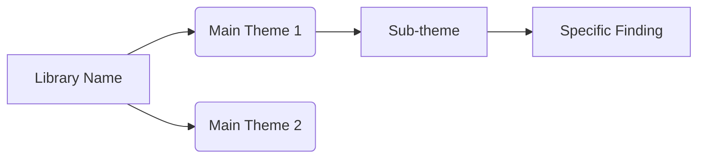

# Research Synthesizer

Transform an enriched research library into thematic maps and writing perspectives through
interactive conversation.

## Prerequisites

Before starting, verify access to:
- **Supabase MCP** — for reading citations and writing thematic maps / perspectives
- **Google Drive MCP** — for persisting output files
- **Mermaid MCP** — for validating and rendering diagrams

If any MCP is missing, tell the user which connection is needed and stop.

## Phase 1: Library Selection

Start by identifying which research library to synthesize.

1. Query `research_libraries` via Supabase to list available libraries
2. If multiple exist, ask the user which one to work with
3. Run `get_library_stats(library_id)` to show the user a summary:
   - Total citations, how many have abstracts, verification breakdown
   - Whether thematic maps or perspectives already exist

If the library has fewer than 5 citations with abstracts, warn the user that synthesis
will be thin and suggest running the abstract enrichment pipeline first.

## Phase 2: Thematic Analysis

Page through all citations in the library and build a theme inventory.

### Retrieval Process

Use the `read_library_citations` RPC function to page through entries:

```
First call: { p_library_id: <id>, p_after_sort_key: null, p_after_id: null, p_page_size: 200 }
Subsequent: { p_library_id: <id>, p_after_sort_key: <last_sort_key>, p_after_id: <last_id>, p_page_size: 200 }
Stop when: returned_count = 0
```

### Analysis Process

For each page of results:
1. Read each citation's abstract and metadata
2. Extract key themes, methodologies, and findings
3. Track which citations support each theme
4. Note patterns: convergences, contradictions, gaps

After all pages are processed, build a **theme inventory**:
- Group themes hierarchically (main themes → sub-themes → specific findings)
- Note citation counts per theme
- Identify cross-cutting themes that span multiple sub-domains
- Flag potential research gaps (themes with only 1-2 supporting citations)

### Mermaid Diagram Generation

Generate a Mermaid `graph LR` tree diagram synthesizing all themes:



Node naming conventions:
- Root: library name in brackets
- Main themes: single uppercase letter with parentheses `A(Theme Name)`
- Sub-themes: letter+number `A1[Sub-theme]`
- Details: letter+number+letter `A1a[Detail]`

After generating, validate the diagram using the Mermaid MCP tool. Fix any syntax errors
before presenting to the user.

### User Review

Present the diagram to the user and ask: "Does this thematic map capture the key themes
in your research? Want me to adjust anything?"

If the user is unhappy, ask what to change and regenerate. If happy, proceed to persistence.

### Persistence

1. Convert mermaid markdown to a `.md` file
2. Upload to Google Drive (user-specified folder)
3. Store in `thematic_maps` table via Supabase with:
   - `library_id`, `mermaid_code`, `mermaid_markdown`, `theme_inventory` (as JSONB)
   - `gdrive_file_id` and `gdrive_url` from the upload response

## Phase 3: Perspective Architect

Guide the user through defining their writing perspective. This is interactive — ask one
question at a time, confirm each answer before moving on.

### Step 1: Writing Perspective

Explain that you'll help define the angle for their content. Offer examples based on
what you learned from the thematic analysis:

- Critical/skeptical perspective questioning assumptions
- Historical development tracing evolution
- Practical applications emphasizing implementation
- Theoretical framework prioritizing concepts
- Disciplinary lens (sociological, economic, technological)
- Stakeholder viewpoint (practitioner, researcher, policy maker)
- Comparative analysis of methods/theories
- Innovation-focused highlighting cutting-edge work

Suggest 2-3 perspectives that seem natural fits based on the themes you found.
Ask: "Which of these resonates, or would you prefer a different angle?"

### Step 2: Target Market

Ask who the content is for. Again, suggest based on the library's content:

- Academic researchers in [specific field from themes]
- Industry professionals in [relevant sector]
- Graduate/undergraduate students
- Policy makers
- General educated public
- Specific professional roles

### Step 3: Sub-themes

Based on the thematic map and their chosen perspective, suggest 4-6 sub-themes
that would make strong sections or chapters. Ask the user to confirm, modify, or
add their own.

### Step 4: Final Assembly

Compile the perspective into a structured JSON:

```json
{
  "topic": "...",
  "target_market": "...",
  "writing_perspective": "...",
  "sub_themes": ["...", "..."]
}
```

Present to the user for final approval.

### Persistence

1. Generate a perspective markdown document
2. Upload to Google Drive
3. Store in `research_perspectives` table via Supabase with all fields populated
4. Provide the user with links to both the thematic map and perspective documents

## Output

After completing all phases, present a summary:

```
Research Synthesis Complete for: [Library Name]

Thematic Map: [Google Drive link]
  - [X] themes identified across [Y] citations
  - [Z] potential research gaps flagged

Perspective: [Google Drive link]
  - Angle: [writing_perspective]
  - Audience: [target_market]
  - Sub-themes: [count]

Next steps:
  - Run /verify-citations to validate references
  - Run /discover-literature to fill identified gaps
  - Use the perspective to guide content creation
```
