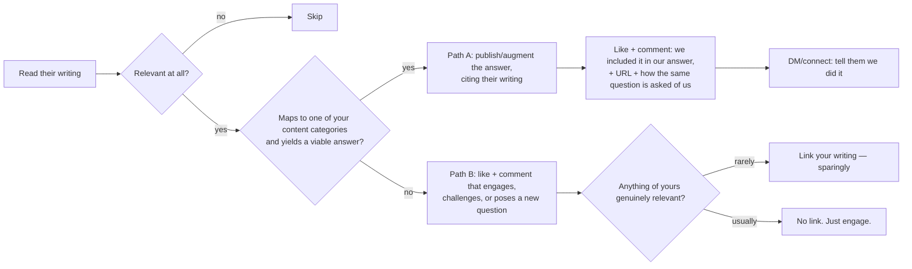

# Topic-Synergy Methodology

The goal: match **what you've published** against **what targets are posting**, so every comment lands on a live thread they already care about, and join it by adding something — never by pitching.

## Part 1 — The fingerprint (the matching key)

You don't hand-feed your content; it's already machine-readable. Distill a **topic fingerprint** from the configured sources (set in `/synergy-init`), which may include:

- a Supabase `/answers` library (`execute_sql` for question + canned_answer + category),
- an anchor paper or POV (a whitepaper, a ResearchGate/DOI essay),
- repo content (blog/news markdown),
- a keyword/audience study (e.g. a SparkToro pull).

The fingerprint is N themes, each with: a canonical claim (your position), **signature phrases** (uniquely yours — the highest-value search seeds; if a target uses one, that's a near-certain opening), broad search seeds (the audience's words), and the persona it serves. Refresh any time — re-running the source queries keeps it current as you publish.

## Part 2 — Two topic centers

| Center | Anchored on | Discovery | Lane |
|---|---|---|---|
| **Author** | your `/answers` + the target's own work | `harvestapi/linkedin-profile-posts` (by profile URL) | relationship-building from a named list |
| **Content** | your anchor paper / POV | `harvestapi/linkedin-post-search` (by keyword/hashtag) | reach-expanding; the content finds the author |

The content center's "where do we fit" answer is the wedge: most of the discourse tracks one thing (in your domain); your anchor paper supplies what tracking can't. Phrase the comment as that contribution.

**Competitor rule.** Strong posts in the content center are often by founders of competing products. Engage at the **idea level** — cite the paper, never the product, name a genuine distinction, stay collegial. Log them as a peer tier; no connect/sell.

## Part 3 — Scoring

For each discovered post, score against the fingerprint:

1. **Theme hit (0..N):** which themes the post touches. A signature-phrase match counts double.
2. **Stance:** does it *extend* your position (easy "yes, and"), *contradict* it (a sharp opening), or sit *adjacent*?
3. **Recency & heat:** newer + higher-engagement posts are better comment real estate.
4. **Persona fit:** does the angle match the persona you mapped?

Output a per-target **synergy card**: best on-theme post (verbatim excerpt + URL + engagement), themes hit, stance, type (advisor / competitor-vendor / other), and the angle for your comment. Rank High/Medium/Low; be strict — governance-in-the-abstract is Medium at best. When a discovery dataset is too large to read inline, delegate scoring to a subagent over the saved JSON and have it return only the ranked cards.

## Part 4 — The engagement cycle (decision tree)

Always act first. Every target runs through one tree.

**Path A** (maps to a category): augment the page citing their work → like + comment with your URL → DM. On non-posting experts: cite, then DM (the cite-then-tell lever).

**Path B** (relevant, no fit): like + engage/challenge/question. Link your own work only when directly relevant; default is no link.

**Always pair a positive comment with the like.** A supportive comment without a reaction reads half-hearted.

**The third lever — cite-then-tell (strongest).** Cite the target's own work, or your anchor paper, in your content, then open with "we cite your work in our answer on X." True flattery, warmest open, and it raises your own AEO authority. The only lever that works on people who don't post.

## Part 5 — Output artifacts

- `synergy-scan-<date>.md` — ranked synergy cards + the two-touch (or three-lever) sequence per hot account, with drafted comments and DM/connect notes.
- The xlsx tracker (see `tracker-schema.md`) — the queue and the memory.

## Part 6 — Per-touch sequence

1. **Like + comment** now (the introduction). Tuned to the live post.
2. **Wait** for the comment to land (a few days).
3. **DM/connect** referencing the commented post (the warm open). For a non-connection the vehicle is a connection request with a ~300-char note (no room for the URL — the comment carries it); an InMail is the alternative when you want the link inline.
4. Offer the shareable artifact only after a reply, and only where it answers something they raised.
